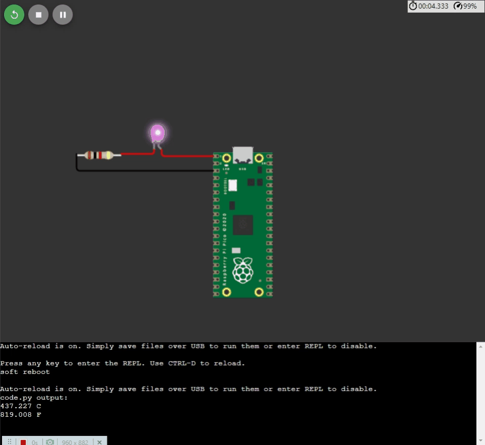
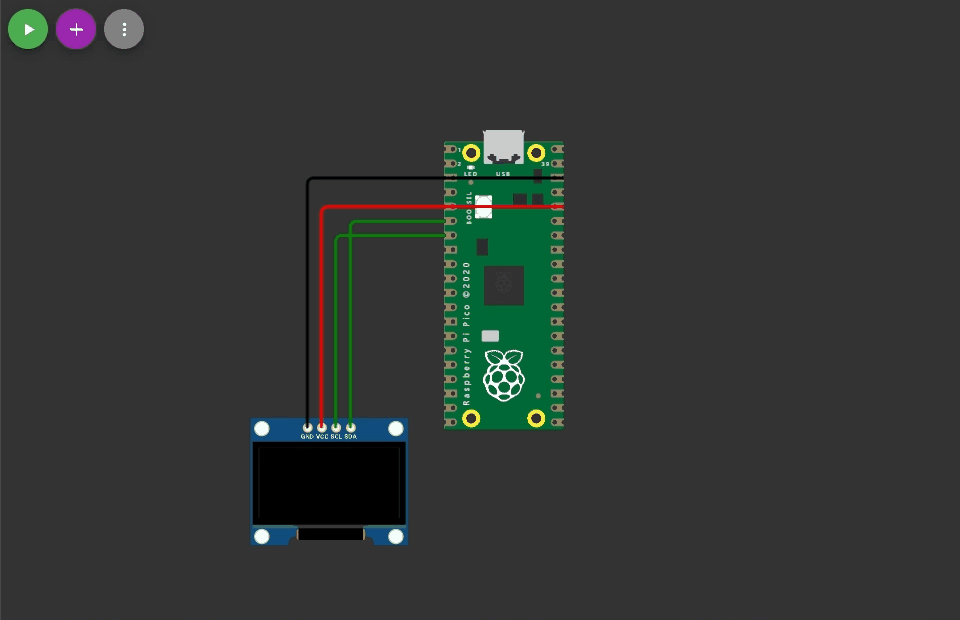
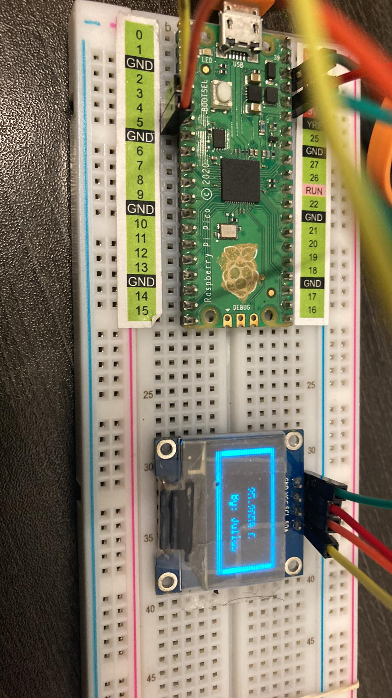

#    Tecnológico Nacional de México
#   Instituto Tecnológico de Tijuana
#        Subdirección Académica
# Departamento de Sistemas y Computación
##  Ingeniería en Sistemas Computacionales
##        SISTEMAS PROGRAMABLES
##   Profesor: MC. René Solis Reyes
##     Semestre sep - ene 2022
----
# Practica Bloque: I.- SENSORES
# Objetivo:  AUTOMATIZACIÓN USANDO "MAKE" EN TERMINAL
----

# LOPEZ MEDRANO JULIO ANTONIO #17211533


-----

# PRACTICA #1
## Blink and Temperature

```bash
#Importamos Librerias a utilizar:
import board
import microcontroller
import digitalio
import time

#Declaramos el Pin al que estará conectado el Led y por donde debe tener salida:
led = digitalio.DigitalInOut(board.GP0)
led.direction = digitalio.Direction.OUTPUT

#Imprimimos en consola básica la temperatura en Centígrados y Fahrenheit:
print(str(microcontroller.cpu.temperature) + " C") 
print(str(microcontroller.cpu.temperature * (9/5) +32) + " F")

#Loop infinito para realizar el blink del dispositivo:
while True:
  led.value = True
  time.sleep(1)
  led.value = False
  time.sleep(1)
```


---

# PRACTICA #2
## Componente Básico de Pantalla (SSD1306)
```bash

#Importamos las librerias necesarias
import board
import busio
import displayio
import terminalio
import adafruit_displayio_ssd1306p
from adafruit_display_text import label

#Configuramos las lineas de reloj (slc) y de datos (sda) asignandoles los pines correspondientes:
i2c = busio.I2C (scl=board.GP5, sda=board.GP4) 

#Asignamos la direccion de la pi pico:
display_bus = displayio.I2CDisplay (i2c, device_address = 0x3C) 

display = adafruit_displayio_ssd1306p.SSD1306(display_bus, width=128, height=64)
splash = displayio.Group()
display.show(splash)

color_bitmap = displayio.Bitmap(128, 64, 1) #Pintamos toda la pantalal de blanco
color_palette = displayio.Palette(1)
color_palette[0] = 0xFFFFFF  # White
 
bg_sprite = displayio.TileGrid(color_bitmap, pixel_shader=color_palette, x=0, y=0)
splash.append(bg_sprite)

#Establecemos un margen para el display:
inner_bitmap = displayio.Bitmap(118, 54, 1)
inner_palette = displayio.Palette(1)
inner_palette[0] = 0x000000  # Black
inner_sprite = displayio.TileGrid(inner_bitmap, pixel_shader=inner_palette, x=5, y=4)
splash.append(inner_sprite)
 
#Creamos la etiqueta con nuestro nombre la cual aparecerá a partir del pixel 18 en X y 15 en Y:
text = "Julio Lopez"
text_area = label.Label(terminalio.FONT, text=text, color=0xFFFF00, x=18, y=15)
splash.append(text_area)
 
while True:
    pass

```



---

# PRACTICA #3
## Adaptación fuera del Simulador:

```bash

Pending...

```


---

# PRACTICA #4
## Interface UX de CSharp

```bash

Pending...

```

